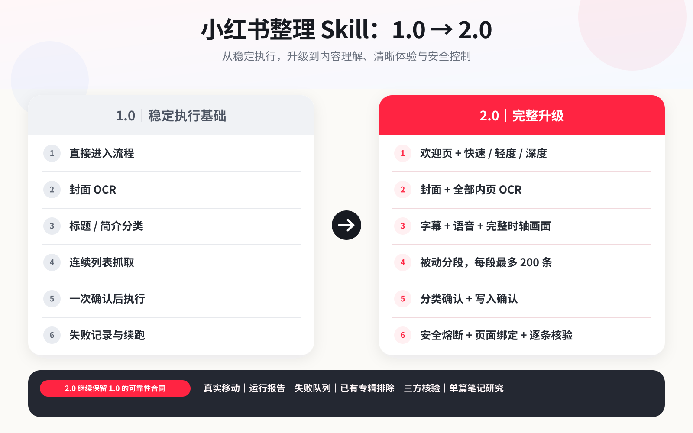

# 小红书整理 Skill 2.0 相比 1.0 的更新说明



## 对比口径

- **1.0 基线**：Git 提交 `f0ed293172d261fa52270c3f8c31389873e8e249`。
- **2.0 对象**：2026-07-30 的完整本地工作区，不是桌面的 RedSkill 单文件摘要。
- **状态说明**：本文区分“完整 2.0 已实现能力”和“单文件说明中出现但尚未随仓库代码落地的能力”，不把规划写成已发布功能。

## 一句话总结

1.0 的重点是浏览器整理、真实移动、逐条报告和恢复审计；2.0 在保留这些可靠性合同的基础上，主要升级了首次使用体验、整理深度选择、图文全内页 OCR、视频真实内容理解、被动分段读取、浏览器授权绑定和安全熔断。

## 主要升级

| 方向 | 1.0 | 2.0 | 用户价值 |
|---|---|---|---|
| 首次使用 | 直接进入范围和环境检查 | 增加欢迎说明、能力预检和整理深度选择 | 不懂技术也能知道下一步要做什么 |
| 整理模式 | 单一完整流程 | 快速、轻度、深度和自定义 | 可按时间与准确率选择成本 |
| 图文识别 | 主要识别封面 OCR | 明确补齐封面和全部内页后逐张 OCR | 减少只看标题或封面造成的误分类 |
| 视频理解 | 主要依赖标题、简介或已有文本 | 可使用字幕、语音转写和完整时轴真实画面 | 无声视频、弱标题视频也能按实际内容分类 |
| 模型选择 | 对宿主能力约束较强 | 支持本地 MiMo、已有 Agent/API 或显式命令适配器 | 不强制绑定 Codex CLI |
| 收藏读取 | 可滚动抓取完整列表 | 默认每段最多 200 条，只读当前已显示内容 | 降低连续页面请求和误操作风险 |
| 浏览器授权 | 以可用浏览器后端为主 | 要求当前回合明确授权具体浏览器，并绑定页面身份 | 避免误用旧授权或错误标签页 |
| 移动确认 | 分类确认后执行 | 分类方案确认与真实写入再次确认分离 | 用户更清楚何时会修改账号 |
| 安全状态 | 失败后记录和续跑 | 增加共享安全状态、首个异常熔断和新会话恢复规则 | 遇到验证时不刷新、不重试、不绕过 |
| 分类预览 | 以逐条结果为主 | 先显示专辑、数量、低置信度和待确认数，再按需展开 | 大量收藏时更容易审阅 |
| 移动核验 | 移动后检查目标专辑 | 增加页面绑定、逐条提交、目标成员查询和前后快照 | 避免把空返回或静默失败误报为成功 |

## 1. 启动体验与能力选择

2.0 把首次运行顺序固定为：

1. 选择整理范围：收藏、点赞或两者合并。
2. 运行只读能力预检，不访问浏览器、不联网、不安装、不加载大型模型。
3. 选择快速、轻度、深度或自定义整理。
4. 只为用户已开启的能力检查和安装依赖。
5. 取得当前回合对具体浏览器的明确授权。

各模式的目标：

- **快速整理**：只按标题、正文、标签和作者分类，不运行 OCR、语音或画面模型。
- **轻度整理**：增加图文全内页 OCR，不分析视频声音和画面。
- **深度整理**：增加图文 OCR、视频语音文字和完整时轴画面分析。
- **自定义**：逐项决定图文 OCR、视频语音和视频画面能力。

选择整理模式不等于授权浏览器访问，也不等于授权移动笔记。

## 2. 图文 OCR 从封面扩展到全部内页

2.0 把图文 OCR 拆成两个可验证阶段：

1. 在用户明确限定的范围内访问详情，取得权威内容类型和完整图片列表。
2. 只有图片集合完整、顺序一致并带有本次运行指纹时，才逐张 OCR。

关键变化：

- 列表页封面只算已观察线索，不再冒充完整图片集合。
- 图片列表不完整时输出 `incomplete_image_set`，不得只识别封面后声称完成。
- OCR 关闭时必须显式跳过，不得静默复用已安装能力。
- 没有文字的纯画面不属于 OCR，不以 OCR 结果猜测人物、物体或动作。

## 3. 视频按真实内容分类

2.0 新增可选的视频内容链路：

- 平台字幕或本地 ASR 生成带时间信息的文字稿。
- 文字稿质量不足时标记为不可用于自动分类。
- 用户开启画面分析后，从完整时轴选择真实帧并生成内容 memo。
- 分类结果记录 `classification_basis`、`video_analysis_status`、主要主题、内容摘要、目标专辑、置信度和原因。
- 视频分析失败时保留 `video_content_unavailable` 并进入人工复核，不回退成简介或封面 OCR 分类。

视觉分析提供者由用户明确选择，可以是本地 MiMo-VL、已有 Agent/API 或命令适配器；Codex CLI 不是强制依赖。

## 4. 被动分段读取与浏览器绑定

2.0 默认使用被动分段：

- 每段最多 200 条。
- 只读取用户当前已经打开并显示的卡片。
- 不自动滚动、刷新、导航、点开详情或进入下一段。
- 每段独立保存，全部分段只在本地合并。
- 页面声明数量、已保存分段数量和本地合并数量分别记录，不能把 UI 总数当作已经抓取完成。

真实写入时，Arc 需要绑定稳定的窗口、标签页、页面标记和预期 URL；其他浏览器也必须使用用户本轮明确授权的后端。绑定失效时停止，不自动切换浏览器。

## 5. 双重确认与真实移动

2.0 继续保留 1.0 的真实前端移动路径，并强化执行边界：

1. 生成并展示 `classification.json`。
2. 当前已有专辑成员固定保护；用户只确认专辑外笔记的分类方案和目标专辑。
3. 运行 dry-run，生成不修改账号的执行报告。
4. 用户再次明确授权真实写入。
5. 每次只提交一条移动。
6. 通过目标专辑成员查询确认 note id 已出现后，才记录成功。

真实移动继续使用已验证的前端调用形状 `{targetBoardId, notesId}`。空返回或没有报错都不等于成功，必须继续查询目标专辑成员。

## 6. 安全熔断与恢复

2.0 新增共享 `xhs_safety_state.json`，让同一轮读取、详情、视频和移动使用同一个安全状态。

出现以下任一情况时立即保存并停止：

- 安全验证或异常访问；
- 登录页；
- 页面、窗口或标签绑定失效；
- 浏览器返回首个错误；
- 写入结果无法确认。

安全停止后不得刷新、自动重试、模拟真人或绕过验证。用户完成平台处理后，需要从新的只读会话重新检查页面与状态；旧的 `security_halted` 状态不能直接续跑。

## 7. 大批量分类预览与运行产物

2.0 的默认预览先显示：

- 建议专辑名；
- 每个专辑的条目数量；
- 低置信度数量；
- 待人工确认数量；
- 视频分析失败数量。

用户可以选择只看汇总，或展开逐条审阅。

新增或强化的运行产物包括：

- `image_items.json`
- `ocr_results.json`
- `video_transcripts.json`
- `video_analysis.json`
- `classification.json`
- `run_report.json`
- `retry_queue.json`
- `xhs_safety_state.json`
- `boards.before.json` / `boards.after.json`

## 8. 1.0 可靠性能力仍然保留

下列能力不属于 2.0 应删除的旧流程，完整 2.0 必须继续保留：

| 1.0 能力 | 2.0 保留方式 |
|---|---|
| 真实 `note/move` 调用和移动后成员查询 | 继续由批处理执行器逐条调用并验证 |
| `run_report.json` 和 `retry_queue.json` | 继续逐条落盘；安全停止项不可自动重试 |
| 已有专辑排除 | 使用 `existing_boards_inventory.json`，默认不移动已有专辑内容 |
| UI 数量与真实成员三方核验 | 比较列表集合、专辑成员集合、页面显示数量和重复 note id |
| 单篇笔记研究 | 继续作为独立只读工作流，不能调用账号写入脚本 |
| 自动测试和发布审计 | 继续运行单元测试、无副作用烟测和分发可用性检查 |

## 9. 当前尚未完整随仓库落地的内容

桌面的 RedSkill 单文件摘要提到以下能力，但当前完整仓库没有对应脚本，因此不能标记为已发布：

- `scripts/onboarding_config.py`
- `scripts/weekly_delta.py`

因此：

- “保存一次设置后自动安排后续分段”目前只能视为交互规范，不是已交付的独立执行器。
- “每周只整理新增内容”目前只能视为计划能力，不能声称已有可运行的增量脚本。
- RedSkill 单文件仍引用外部脚本，本质是流程说明，不是可以脱离仓库独立运行的单文件程序。

发布 2.0 前必须选择一种明确方案：补齐并测试这些脚本，或者从公开说明中删除对应承诺。

## 10. 兼容与迁移

- 1.0 的 `visible_items.json`、`classification.json`、`run_report.json` 和 `retry_queue.json` 继续作为基础数据合同。
- 开启图文全内页 OCR 或视频内容分类时，需要使用 2.0 新增字段和运行指纹，不能把旧封面 OCR 或简介推断伪装成新链路结果。
- 旧报告只有在安全状态仍为 `active`、目标专辑没有变化且成功项完全一致时才允许差量续跑。
- 从 1.0 升级不会自动创建、删除、重命名专辑，也不会自动移动笔记。

## 11. 发布前验证

至少执行：

```bash
python3 -m compileall -q .
python3 -m unittest discover -s tests -p 'test_*.py'
python3 scripts/check_environment.py --capability-preflight
python3 scripts/classify_items.py --skip-ocr examples/visible_items.example.json /tmp/xhs-classification.json
python3 scripts/run_reassign_batch.py /tmp/xhs-classification.json /tmp/xhs-classification-preview.json
python3 scripts/build_retry_queue.py /tmp/xhs-classification-preview.json /tmp/xhs-retry-queue.json
```

上述批处理烟测必须得到 `mode=classification_preview`、`ready_for_execute=false`；不能把它称为 dry-run。真实 `board_snapshot.json`、硬闸门 dry-run 和移动不属于自动发布测试，只能在用户当前回合明确授权的已登录浏览器中进行，并且真实移动必须再次得到明确授权。
